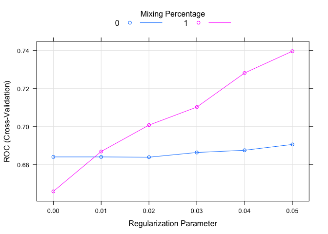

Marvel or DC
================

Can we predict whether a given super hero belongs to the Marvel or DC universe based on their super powers?
-----------------------------------------------------------------------------------------------------------

``` r
library(dplyr)
```

    ## 
    ## Attaching package: 'dplyr'

    ## The following objects are masked from 'package:stats':
    ## 
    ##     filter, lag

    ## The following objects are masked from 'package:base':
    ## 
    ##     intersect, setdiff, setequal, union

``` r
library(ggplot2)
library(caret)
```

    ## Loading required package: lattice

``` r
library(data.table)
```

    ## 
    ## Attaching package: 'data.table'

    ## The following objects are masked from 'package:dplyr':
    ## 
    ##     between, first, last

``` r
rm(list = ls())
setwd('~/marvel_or_dc')

hero_info = read.csv('heroes_information.csv') %>% 
  mutate(Publisher = factor(Publisher),
         Alignment = factor(Alignment))
hero_powers = read.csv('super_hero_powers.csv', stringsAsFactors = F) %>% 
  mutate(hero_names = as.character(hero_names)) %>% 
  data.table()


hero_powers = as.data.frame(lapply(hero_powers, function(y) gsub("False", 0, y)))
hero_powers = as.data.frame(lapply(hero_powers, function(y) gsub("True", 1, y)))
hero_powers[,2:ncol(hero_powers)] = as.data.frame(lapply(hero_powers[,2:ncol(hero_powers)], 
                                                         function(x) as.numeric(x)))

marvel_dc = hero_info %>% 
  select(name, Publisher, Alignment) %>% 
  filter(Publisher %in% c('Marvel Comics', 'DC Comics')) %>% 
  mutate(Publisher = factor(Publisher)) %>% 
  inner_join(hero_powers, by = c("name" = "hero_names")) %>% 
  filter(Alignment != '-') %>% 
  mutate(Publisher = factor(ifelse(Publisher == 'Marvel Comics', 'marvel', 'dc')))
```

    ## Warning: Column `name`/`hero_names` joining factors with different levels,
    ## coercing to character vector

Control Arguments
-----------------

10 Fold Cross Validation

``` r
#set control arguments
mycontrol = trainControl(method = 'cv',
                         number = 10,
                         classProbs = T,
                         summaryFunction = twoClassSummary,
                         verboseIter = TRUE)

training_indices = createDataPartition(y = marvel_dc$Publisher,
                                       p = .7,
                                       list = FALSE)

training = marvel_dc[training_indices,]
testing = marvel_dc[-training_indices,]
```

Generalized Linear Model
------------------------

Using a genarlized linear model with feature selection.

Ridge regression is the best performing model (alpha = 1) with a lambda value of .04 (slightly penalized coefficients)

``` r
glmnet_model = train(Publisher ~ .,
                     training %>% select(-name),
                     method = 'glmnet',
                     trControl = mycontrol,
                     tuneGrid = expand.grid(alpha = 0:1, 
                                            lambda = seq(0, .05, by = .01)))
```

    ## Warning in train.default(x, y, weights = w, ...): The metric "Accuracy" was
    ## not in the result set. ROC will be used instead.

    ## + Fold01: alpha=0, lambda=0.05 
    ## - Fold01: alpha=0, lambda=0.05 
    ## + Fold01: alpha=1, lambda=0.05 
    ## - Fold01: alpha=1, lambda=0.05 
    ## + Fold02: alpha=0, lambda=0.05 
    ## - Fold02: alpha=0, lambda=0.05 
    ## + Fold02: alpha=1, lambda=0.05 
    ## - Fold02: alpha=1, lambda=0.05 
    ## + Fold03: alpha=0, lambda=0.05 
    ## - Fold03: alpha=0, lambda=0.05 
    ## + Fold03: alpha=1, lambda=0.05 
    ## - Fold03: alpha=1, lambda=0.05 
    ## + Fold04: alpha=0, lambda=0.05 
    ## - Fold04: alpha=0, lambda=0.05 
    ## + Fold04: alpha=1, lambda=0.05 
    ## - Fold04: alpha=1, lambda=0.05 
    ## + Fold05: alpha=0, lambda=0.05 
    ## - Fold05: alpha=0, lambda=0.05 
    ## + Fold05: alpha=1, lambda=0.05 
    ## - Fold05: alpha=1, lambda=0.05 
    ## + Fold06: alpha=0, lambda=0.05 
    ## - Fold06: alpha=0, lambda=0.05 
    ## + Fold06: alpha=1, lambda=0.05 
    ## - Fold06: alpha=1, lambda=0.05 
    ## + Fold07: alpha=0, lambda=0.05 
    ## - Fold07: alpha=0, lambda=0.05 
    ## + Fold07: alpha=1, lambda=0.05 
    ## - Fold07: alpha=1, lambda=0.05 
    ## + Fold08: alpha=0, lambda=0.05 
    ## - Fold08: alpha=0, lambda=0.05 
    ## + Fold08: alpha=1, lambda=0.05 
    ## - Fold08: alpha=1, lambda=0.05 
    ## + Fold09: alpha=0, lambda=0.05 
    ## - Fold09: alpha=0, lambda=0.05 
    ## + Fold09: alpha=1, lambda=0.05 
    ## - Fold09: alpha=1, lambda=0.05 
    ## + Fold10: alpha=0, lambda=0.05 
    ## - Fold10: alpha=0, lambda=0.05 
    ## + Fold10: alpha=1, lambda=0.05 
    ## - Fold10: alpha=1, lambda=0.05 
    ## Aggregating results
    ## Selecting tuning parameters
    ## Fitting alpha = 1, lambda = 0.02 on full training set

``` r
plot(glmnet_model)
```



Testing the Results of the Model
--------------------------------

Our model tends to err on the side of predicting a super hero to belong to Marvel comics over DC comics.

-   Sensitivity - 31% - percent of DC super heroes correctly predicted to be DC comics

-   Specificity - 93% - percent of Marvel super heroes correctly predicted to belong to Marvel Comics

-   Pos Pred value - 72% - percent of predicted DC super heroes that actually belonged to DC

-   Neg Pred Value - 70% - percent of predicted marvel heroes that actually belonged to Marvel.

Model often misclassifies heroes as belonging to the Marvel universe when they are DC. In the case where a hero is predicted to be a DC super hero, that is most often the case.

This tells us that there are some super powers which are more exclusive to the DC universise whereas the ones mostly found in the Marvel universe can be found in DC's as well.

``` r
confusionMatrix(predict(glmnet_model, testing), testing$Publisher)
```

    ## Confusion Matrix and Statistics
    ## 
    ##           Reference
    ## Prediction dc marvel
    ##     dc     21      7
    ##     marvel 37     94
    ##                                           
    ##                Accuracy : 0.7233          
    ##                  95% CI : (0.6468, 0.7912)
    ##     No Information Rate : 0.6352          
    ##     P-Value [Acc > NIR] : 0.01191         
    ##                                           
    ##                   Kappa : 0.329           
    ##  Mcnemar's Test P-Value : 1.232e-05       
    ##                                           
    ##             Sensitivity : 0.3621          
    ##             Specificity : 0.9307          
    ##          Pos Pred Value : 0.7500          
    ##          Neg Pred Value : 0.7176          
    ##              Prevalence : 0.3648          
    ##          Detection Rate : 0.1321          
    ##    Detection Prevalence : 0.1761          
    ##       Balanced Accuracy : 0.6464          
    ##                                           
    ##        'Positive' Class : dc              
    ##
