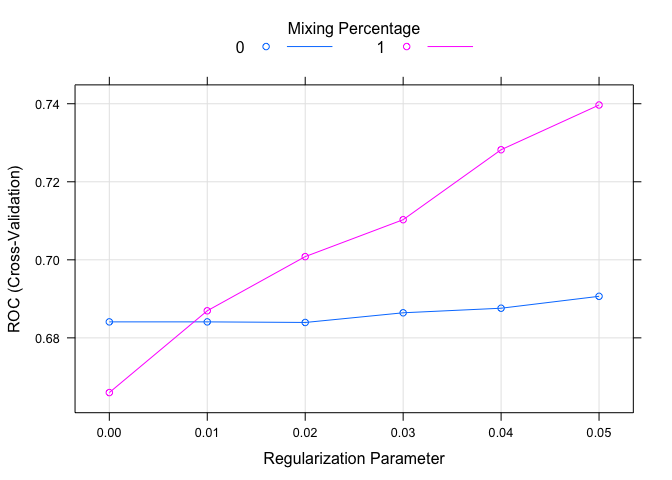

Marvel or DC
================

Can we predict whether a given super hero belongs to the Marvel or DC universe based on their super powers?
-----------------------------------------------------------------------------------------------------------

``` r
library(dplyr)
```

    ## 
    ## Attaching package: 'dplyr'

    ## The following objects are masked from 'package:stats':
    ## 
    ##     filter, lag

    ## The following objects are masked from 'package:base':
    ## 
    ##     intersect, setdiff, setequal, union

``` r
library(ggplot2)
library(caret)
```

    ## Loading required package: lattice

``` r
library(data.table)
```

    ## 
    ## Attaching package: 'data.table'

    ## The following objects are masked from 'package:dplyr':
    ## 
    ##     between, first, last

``` r
rm(list = ls())
setwd('~/super_heroes')

hero_info = read.csv('heroes_information.csv') %>% 
  mutate(Publisher = factor(Publisher),
         Alignment = factor(Alignment))
hero_powers = read.csv('super_hero_powers.csv', stringsAsFactors = F) %>% 
  mutate(hero_names = as.character(hero_names)) %>% 
  data.table()


hero_powers = as.data.frame(lapply(hero_powers, function(y) gsub("False", 0, y)))
hero_powers = as.data.frame(lapply(hero_powers, function(y) gsub("True", 1, y)))
hero_powers[,2:ncol(hero_powers)] = as.data.frame(lapply(hero_powers[,2:ncol(hero_powers)], 
                                                         function(x) as.numeric(x)))

marvel_dc = hero_info %>% 
  select(name, Publisher, Alignment) %>% 
  filter(Publisher %in% c('Marvel Comics', 'DC Comics')) %>% 
  mutate(Publisher = factor(Publisher)) %>% 
  inner_join(hero_powers, by = c("name" = "hero_names")) %>% 
  filter(Alignment != '-') %>% 
  mutate(Publisher = factor(ifelse(Publisher == 'Marvel Comics', 'marvel', 'dc')))
```

    ## Warning: Column `name`/`hero_names` joining factors with different levels,
    ## coercing to character vector

Control Arguments
-----------------

10 Fold Cross Validation

``` r
#set control arguments
mycontrol = trainControl(method = 'cv',
                         number = 10,
                         classProbs = T,
                         summaryFunction = twoClassSummary,
                         verboseIter = TRUE)
```

Generalized Linear Model
------------------------

Using a genarlized linear model with feature selection.

Ridge regression is the best performing model (alpha = 1) with a lambda value of .04 (slightly penalized coefficients)

``` r
glmnet_model = train(Publisher ~ .,
                     marvel_dc %>% select(-name),
                     method = 'glmnet',
                     trControl = mycontrol,
                     tuneGrid = expand.grid(alpha = 0:1, 
                                            lambda = seq(0, .05, by = .01)))
```

    ## Warning in train.default(x, y, weights = w, ...): The metric "Accuracy" was
    ## not in the result set. ROC will be used instead.

    ## + Fold01: alpha=0, lambda=0.05 
    ## - Fold01: alpha=0, lambda=0.05 
    ## + Fold01: alpha=1, lambda=0.05 
    ## - Fold01: alpha=1, lambda=0.05 
    ## + Fold02: alpha=0, lambda=0.05 
    ## - Fold02: alpha=0, lambda=0.05 
    ## + Fold02: alpha=1, lambda=0.05 
    ## - Fold02: alpha=1, lambda=0.05 
    ## + Fold03: alpha=0, lambda=0.05 
    ## - Fold03: alpha=0, lambda=0.05 
    ## + Fold03: alpha=1, lambda=0.05 
    ## - Fold03: alpha=1, lambda=0.05 
    ## + Fold04: alpha=0, lambda=0.05 
    ## - Fold04: alpha=0, lambda=0.05 
    ## + Fold04: alpha=1, lambda=0.05 
    ## - Fold04: alpha=1, lambda=0.05 
    ## + Fold05: alpha=0, lambda=0.05 
    ## - Fold05: alpha=0, lambda=0.05 
    ## + Fold05: alpha=1, lambda=0.05 
    ## - Fold05: alpha=1, lambda=0.05 
    ## + Fold06: alpha=0, lambda=0.05 
    ## - Fold06: alpha=0, lambda=0.05 
    ## + Fold06: alpha=1, lambda=0.05 
    ## - Fold06: alpha=1, lambda=0.05 
    ## + Fold07: alpha=0, lambda=0.05 
    ## - Fold07: alpha=0, lambda=0.05 
    ## + Fold07: alpha=1, lambda=0.05 
    ## - Fold07: alpha=1, lambda=0.05 
    ## + Fold08: alpha=0, lambda=0.05 
    ## - Fold08: alpha=0, lambda=0.05 
    ## + Fold08: alpha=1, lambda=0.05 
    ## - Fold08: alpha=1, lambda=0.05 
    ## + Fold09: alpha=0, lambda=0.05 
    ## - Fold09: alpha=0, lambda=0.05 
    ## + Fold09: alpha=1, lambda=0.05 
    ## - Fold09: alpha=1, lambda=0.05 
    ## + Fold10: alpha=0, lambda=0.05 
    ## - Fold10: alpha=0, lambda=0.05 
    ## + Fold10: alpha=1, lambda=0.05 
    ## - Fold10: alpha=1, lambda=0.05 
    ## Aggregating results
    ## Selecting tuning parameters
    ## Fitting alpha = 1, lambda = 0.03 on full training set

``` r
plot(glmnet_model)
```



Testing the Results of the Model
--------------------------------

Our model tends to err on the side of predicting a super hero to belong to Marvel comics over DC comics.

-   Sensitivity - 29% - percent of DC super heroes correctly predicted to be DC comics

-   Specificity - 96% - percent of Marvel super heroes correctly predicted to belong to Marvel Comics

-   Pos Pred value - 82% - percent of predicted DC super heroes that actually belonged to DC

-   Neg Pred Value - 70% - percent of predicted marvel heroes that actually belonged to Marvel.

If our model predicts that a given super hero belongs to DC comics, there's a pretty good likely hood that it is actually the case.

If our model predicts that a super hero belongs to Marvel, there is a higher chance of misclassification error.

``` r
confusionMatrix(predict(glmnet_model, marvel_dc), marvel_dc$Publisher)
```

    ## Confusion Matrix and Statistics
    ## 
    ##           Reference
    ## Prediction  dc marvel
    ##     dc      69     12
    ##     marvel 126    326
    ##                                           
    ##                Accuracy : 0.7411          
    ##                  95% CI : (0.7017, 0.7778)
    ##     No Information Rate : 0.6341          
    ##     P-Value [Acc > NIR] : 9.479e-08       
    ##                                           
    ##                   Kappa : 0.3633          
    ##  Mcnemar's Test P-Value : < 2.2e-16       
    ##                                           
    ##             Sensitivity : 0.3538          
    ##             Specificity : 0.9645          
    ##          Pos Pred Value : 0.8519          
    ##          Neg Pred Value : 0.7212          
    ##              Prevalence : 0.3659          
    ##          Detection Rate : 0.1295          
    ##    Detection Prevalence : 0.1520          
    ##       Balanced Accuracy : 0.6592          
    ##                                           
    ##        'Positive' Class : dc              
    ##
